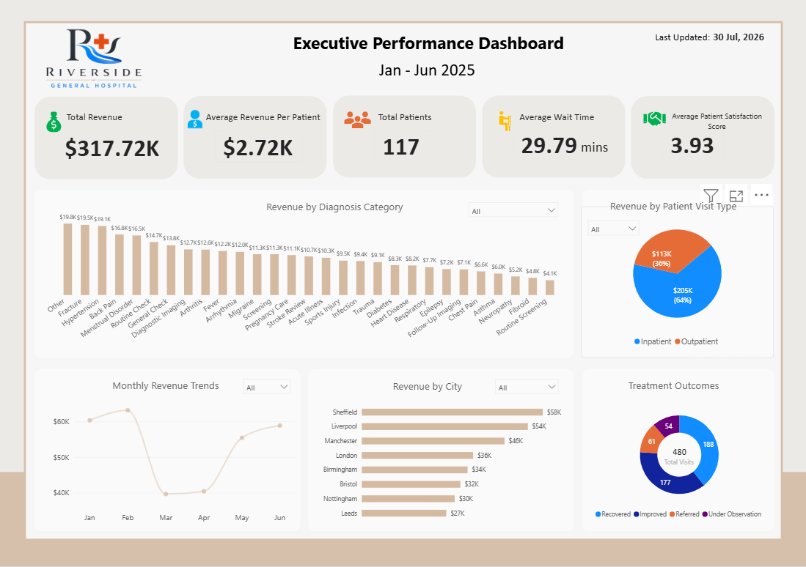

# Healthcare Analytics Dashboard | Power BI Capstone Project

An end-to-end Power BI analytics project that transforms six months of hospital operational data into an interactive executive dashboard. The project demonstrates the complete analytics workflow, from data preparation and data modeling to DAX development, dashboard design, exploratory analysis, and business recommendations.

---

## Quick Navigation

- [Project Overview](#project-overview)
- [Business Problem](#business-problem)
- [Objectives](#objectives)
- [Project Workflow](#project-workflow)
- [Dashboard Features](#dashboard-features)
- [Key Performance Indicators](#key-performance-indicators)
- [Key Findings](#key-findings)
- [Recommendations](#recommendations)
- [Repository Structure](#repository-structure)
- [Project Documentation](#project-documentation)
- [Future Improvements](#future-improvements)
- [About the Author](#about-the-author)

---

# Project Documentation

The complete technical documentation for this project is available below.

| Document | Description |
|----------|-------------|
| [Project Overview](docs/Project%20Overview.md) | Introduces the project, business problem, objectives, and scope. |
| [Data Preparation](docs/Data%20Preparation.md) | Documents the complete Power Query workflow, including cleaning, transformation, and optimization. |
| [Data Modeling](docs/Data%20Modeling.md) | Explains the Star Schema, relationships, Date Table, and model design decisions. |
| [Business KPIs and DAX Measures](docs/Business%20KPIs%20and%20DAX%20Measures.md) | Documents every KPI, DAX measure, and its business purpose. |
| [Dashboard Design](docs/Dashboard%20Design.md) | Explains the dashboard planning process, wireframe, visual selection, and layout decisions. |
| [Exploratory Analysis](docs/Exploratory%20Analysis.md) | Documents the additional investigations completed beyond the dashboard requirements. |
| [Findings and Recommendations](docs/Findings%20and%20Recommendations.md) | Summarizes the project findings and business recommendations. |
| [Project Reflection](docs/Project%20Reflection.md) | Reflects on the lessons learned and the analytical approach developed throughout the project. |

---

## Repository Contents

- 1 Interactive Power BI Dashboard
- 1 Power BI Project (.pbix)
- 8 Technical Documentation Files
- 1 Data Dictionary
- Dashboard Screenshots
- Presentation Slides

---

# Dashboard Preview



---

# Business Problem

Riverside Healthcare needed a centralized reporting solution capable of monitoring hospital performance across six months of operational data. The available information was distributed across multiple monthly datasets, making it difficult to evaluate financial performance, patient activity, operational efficiency, and treatment outcomes from a single reporting solution.

The objective of this project was to consolidate, prepare, and model the data in Power BI, develop business-focused KPIs using DAX, and design an interactive executive dashboard capable of supporting faster reporting and informed decision-making. The project also included exploratory analysis to investigate additional business questions and develop evidence-based recommendations.

---

# Objectives

- Consolidate six months of hospital operational data into a single analytical model.
- Prepare and clean the data using Power Query.
- Build a Star Schema data model.
- Develop business KPIs using DAX.
- Design an interactive executive dashboard.
- Explore additional business questions beyond the project requirements.
- Present findings supported by data.
- Develop practical business recommendations.

---

# Project Workflow

The project followed a structured analytics workflow consisting of eight stages.

1. Data Import
2. Data Preparation
3. Data Modeling
4. DAX Development
5. Dashboard Design
6. Exploratory Analysis
7. Business Findings
8. Recommendations

Detailed documentation for every stage is available in the **docs** directory.

---

# Dashboard Features

The completed dashboard enables users to:

- Monitor financial performance.
- Analyze patient activity.
- Track operational efficiency.
- Review treatment outcomes.
- Filter results using interactive slicers.
- Explore KPIs across multiple business dimensions.

---

# Key Performance Indicators

The dashboard includes the following KPIs:

- Total Revenue
- Total Patients
- Total Hospital Visits
- Average Revenue per Patient
- Average Patient Satisfaction
- Average Waiting Time
- Average Length of Stay
- Insurance Coverage
- Revenue Collection
- Outstanding Treatment Cost
- Repeat Visit Rate

---

# Project Highlights

- Combined six monthly hospital datasets into a single analytical model.
- Built a Star Schema data model to support scalable reporting.
- Developed business KPIs using DAX.
- Designed an executive dashboard based on a wireframe.
- Conducted exploratory analysis beyond the project requirements.
- Produced evidence-based business recommendations.

---

# Key Findings

The analysis covered **480 hospital visits** involving **117 unique patients** across a six-month reporting period.

Major findings included:

- Total Revenue reached **$317.72K**.
- Average Revenue per Patient was approximately **$2.72K**.
- Inpatient services generated approximately **64%** of total revenue.
- Sheffield recorded the highest revenue among all reporting locations.
- Patient satisfaction remained consistently around **3.93 / 5**.
- The overall Average Length of Stay increased from **1.55 days** to **6.27 days** when inpatient visits were analyzed separately.

Additional findings and supporting analysis are documented in the project documentation.

---

# Recommendations

Based on the analysis, the following recommendations were developed:

- Extend reporting to support long-term trend analysis.
- Continue monitoring patient waiting times.
- Expand insurance performance reporting.
- Report inpatient Average Length of Stay separately.
- Investigate factors contributing to revenue differences across hospital locations.

---

# Repository Structure

```text
dashboard/
docs/
data/
images/
assets/
```

---

# Project Documentation

The complete project documentation is available in the **docs** folder.

- 01_Project_Overview.md
- 02_Data_Preparation.md
- 03_Data_Modeling.md
- 04_DAX_Measures.md
- 05_Dashboard_Design.md
- 06_Exploratory_Analysis.md
- 07_Findings_and_Recommendations.md
- 08_Project_Reflection.md

---

# Future Improvements

Potential enhancements for future versions include:

- Longer reporting periods for trend analysis.
- Additional operational datasets.
- Drill-through reporting pages.
- Advanced report tooltips.
- Role-based reporting.
- Predictive analytics.

---

# About the Author

**Chukwuemeka Onyekaodiri**

Data Analyst

---

## Connect With Me

**Portfolio:** https://https://www.chukwuemekaonyekaodiri.com/

**LinkedIn:** https://linkedin.com/in/chukwuemeka-onyekaodiri-53881560

**GitHub:** https://github.com/CDatacentric/CDatacentric

---

Thank you for taking the time to explore this project. Feedback and suggestions are always welcome.

---


# License

This project is licensed under the MIT License.
